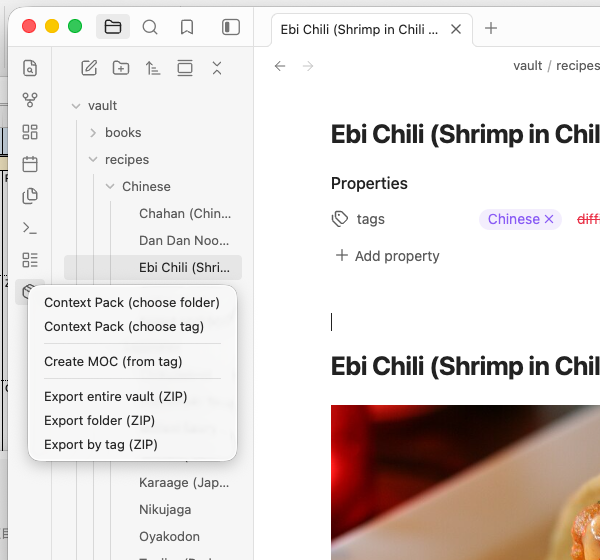
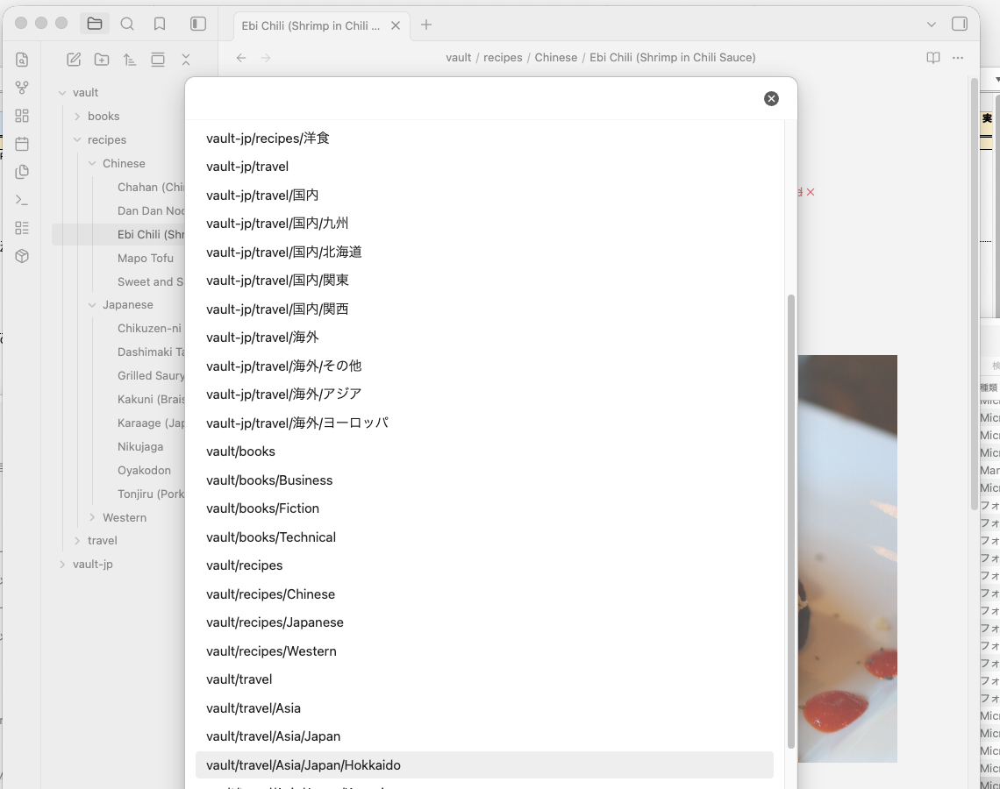
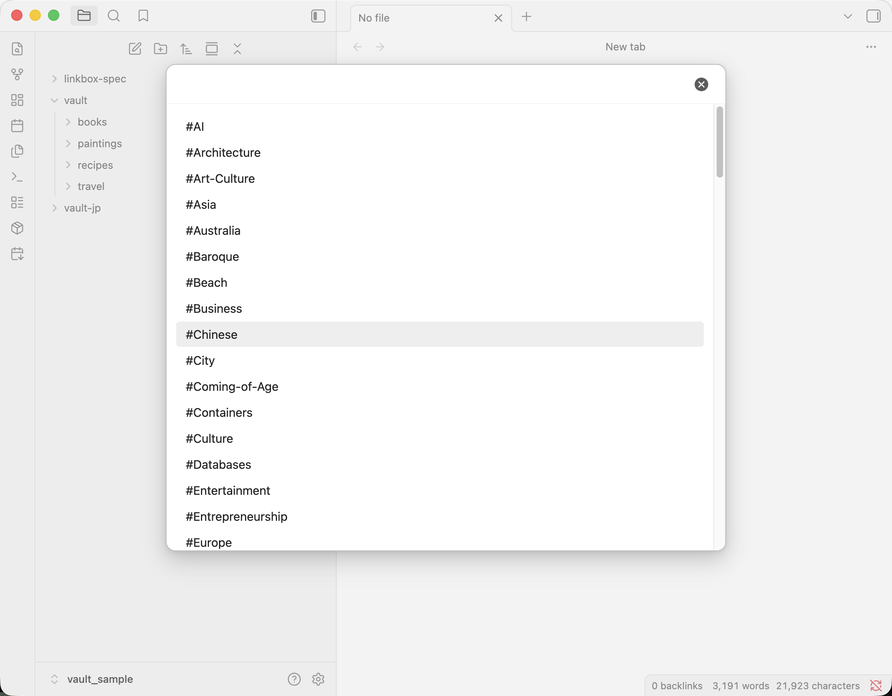
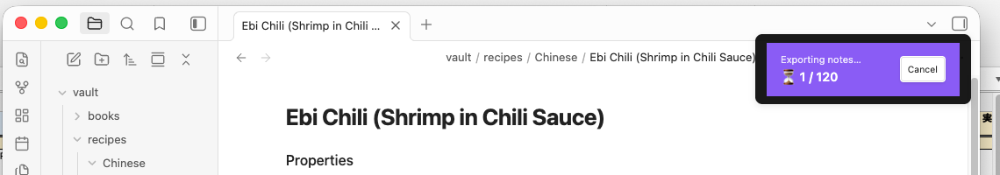
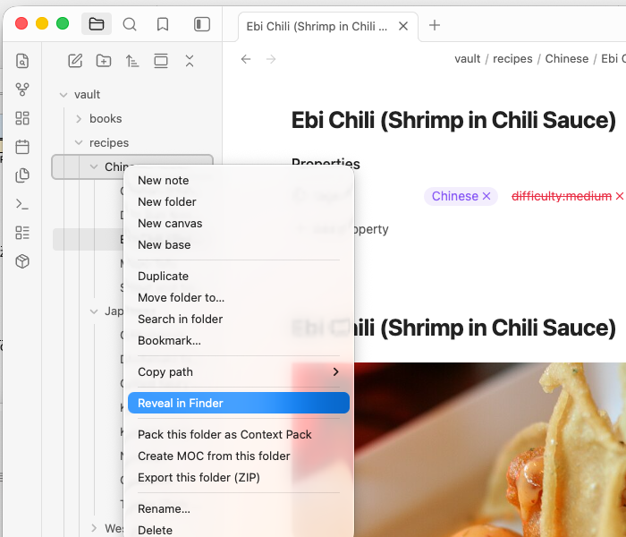
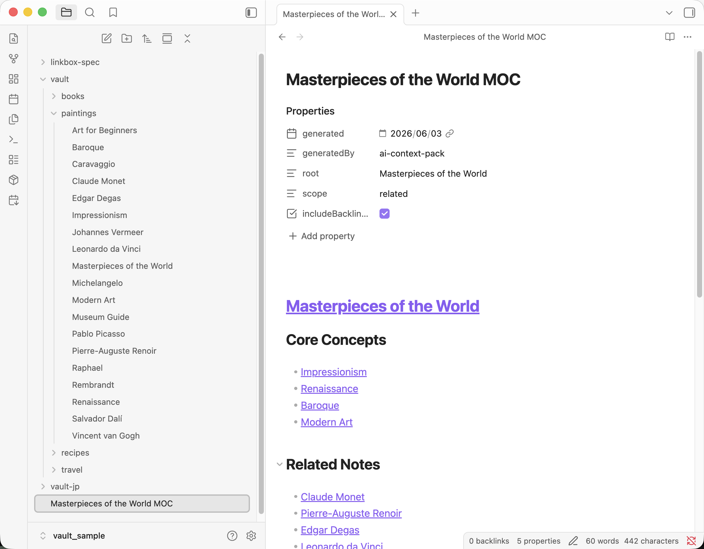

# AI Context Pack

> Package your Obsidian notes into context packs for any AI — NotebookLM, ChatGPT, Claude, Gemini, and more.

---

## Supported AI Assistants

| AI | Output | How to Use |
|---|---|---|
| NotebookLM | ZIP / Text | Upload as source |
| ChatGPT | Markdown | Copy to clipboard / Save file |
| Claude | Markdown | Copy to clipboard / Save file |
| Gemini | Markdown | Copy to clipboard / Save file |
| Claude Code | Markdown | Copy to clipboard / Save file |

---

## The problem

Raw Obsidian notes contain noise:

- Wikilinks
- Frontmatter
- Comments
- Templates

AI models perform better when context is clean and structured. This plugin solves that.

---

## How it works

```
Obsidian Vault
      ↓
 Context Pack
      ↓
 AI-ready Context
      ↓
 ChatGPT / Claude / Gemini / NotebookLM / Claude Code
```

---

## What it does

**Context Pack** bundles related notes into a single formatted `.md` file — organized by folder, tag, or MOC — and strips all Obsidian-specific syntax before export. Each note section includes its vault path so the AI understands your knowledge hierarchy.

**Output target selector** lets you choose where to send the pack each time — NotebookLM, ChatGPT, Claude, Gemini, or Claude Code. For ChatGPT, Claude, and Gemini, the pack is copied to your clipboard so you can paste it straight into any AI chat. A customizable starter prompt is prepended automatically. For Claude Code, the pack is copied as plain structured reference material with no starter prompt.

**Export** packages your notes as a clean ZIP file, ready to upload to NotebookLM as individual sources.

**Daily Notes Pack** collects your daily notes within a date range and bundles them into a single AI-ready file. Filter by tag, choose a preset period, or set a custom range. Supports weekly summary mode.

Both Context Pack and Export run the same formatter: frontmatter is removed, wikilinks are resolved, embeds and comments are stripped, and blank lines are collapsed.

---

## Screenshots

### Ribbon menu — access everything from one icon



### Choose a folder to pack



### Or choose by tag



### Progress dialog with cancel



### Right-click any folder in the file explorer



### The resulting Context Pack — clean, structured, AI-ready



---

## Installation

### Community plugins (recommended)

1. Open **Settings → Community plugins → Browse**
2. Search for **AI Context Pack**
3. Install and enable

### Manual

Download `main.js`, `styles.css`, and `manifest.json` from the [latest release](../../releases/latest) and copy them to `.obsidian/plugins/context-pack-for-notebooklm/` in your vault.

---

## Usage

This plugin adds **two ribbon icons** to the left sidebar:

| Icon | Function |
|------|----------|
| 📦 (package) | Context Pack / Export menu — folder, tag, MOC, and ZIP export |
| 🗓↓ (calendar-arrow-down) | Daily Notes Pack — open the date range picker |

All commands are also available from the **Command Palette** (`Cmd/Ctrl+P`) and **right-click menus** in the file explorer.

### Context Pack

Bundles multiple notes into one `.md` file. After building the pack, the **output target selector** appears — choose NotebookLM, ChatGPT, or another destination.

| Trigger | Source |
|---|---|
| Ribbon → Context Pack (choose folder) | All notes in a selected folder |
| Ribbon → Context Pack (choose tag) | All notes with a selected tag |
| Right-click file → Create Context Pack from this MOC | Notes linked from the current file |
| Command: Create Context Pack from MOC | Same as above |

The pack is saved as `pack-folder-chatgpt-20240101.md` (named by source, AI target, and date).

### Export (ZIP)

Exports notes as individual cleaned-up `.md` files in a ZIP.

| Trigger | Source |
|---|---|
| Ribbon → Export entire vault (ZIP) | Entire vault |
| Ribbon → Export folder (ZIP) | Selected folder |
| Ribbon → Export by tag (ZIP) | Notes with selected tag |
| Right-click folder → Export this folder (ZIP) | That folder |
| Right-click file → Export this note (.md) | Single note |

### MOC (Map of Content)

Automatically generates a MOC note — a list of wikilinks to all notes in a folder or tag. Use it as an index, then run **Create Context Pack from this MOC** to pack exactly those notes.

| Trigger | Source |
|---|---|
| Ribbon → Create MOC (from tag) | All notes with selected tag |
| Right-click folder → Create MOC from this folder | All notes in folder |

---

## Daily Notes Pack

Click the **calendar-arrow-down** ribbon icon (or use the Command Palette) to open the date range picker.

**Presets:** This week / Last week / Last 7 days / Last 14 days / Last 30 days / Custom

**Folder auto-detection** tries the following sources in order:
1. Obsidian built-in Daily Notes plugin settings
2. Japanese Calendar plugin settings
3. Periodic Notes plugin settings
4. Vault scan — finds the folder containing the most `YYYY-MM-DD.md` files

If auto-detection doesn't find the right folder, click **Change folder** in the modal to pick it manually. The selection is saved for next time.

**Exclude tags** — comma-separated list of tags to exclude (e.g. `#private, #draft`). Notes containing any of these tags are skipped.

**Weekly summary** — adds a summary header (`# Weekly Summary: 2026 Week 22`) before the daily notes content.

### Commands

| Command | Description |
|---------|-------------|
| Daily Notes: Create pack (default range) | Uses the default range from settings |
| Daily Notes: Create pack (choose range) | Opens the date range picker modal |
| Daily Notes: Create weekly summary pack | Packs this week's notes with a summary header |

---

## Settings

| Setting | Description | Default |
|---|---|---|
| Output folder | Where to save ZIP exports | Vault root |
| Flatten folder structure | Merge all files into one folder in the ZIP | Off |
| Include frontmatter title | Convert `title:` and `tags:` to plain text at the top of each note | On |
| Open folder after export | Auto-open the output folder when done (desktop only) | Off |
| Custom replacement rules | Find/replace rules applied before export (plain text or regex) | — |

### Output settings

| Setting | Description | Default |
|---|---|---|
| Show output selector | Choose the output target each time | On |
| Default output target | Used when the selector is off | NotebookLM (text) |
| Show token count | Display estimated token count in the selector | On |
| Warn when over limit | Warn when the pack exceeds the AI's recommended token limit | On |
| Open AI website after export | Open the AI site after clipboard copy (ChatGPT, Claude, Gemini) | Off |
| Include starter prompt by default | Prepend a starter prompt to every pack | On |
| Starter prompt | Editable template. Use `{source}` for folder/tag name, `{count}` for note count | — |

### Daily Notes mode settings

| Setting | Description | Default |
|---------|-------------|---------|
| Auto-detect Daily Notes | Auto-detect folder and format from plugin settings | On |
| Daily Notes folder | Folder path (manual, when auto-detect is off) | — |
| Date format | moment.js format | YYYY-MM-DD |
| Default range | Preset period for quick pack | Last 7 days |
| Exclude tags | Tags to skip (comma-separated) | — |
| Sort order | Oldest first / Newest first | Oldest first |

---

## Sample data

Want to try the plugin without setting up your vault first? Download a ready-made sample vault and open it in Obsidian.

| Vault | Notes | Download |
|---|---|---|
| 🇺🇸 English (recipes / travel / books / linkbox-spec) | 65 notes | [vault-sample-en.zip](https://s3.ap-northeast-1.amazonaws.com/assets.dualyzeai.com/obsidian-context-pack/vault-sample-en.zip) |
| 🇯🇵 Japanese（料理 / 旅行 / 読書 / linkbox-spec）| 65件 | [vault-sample-jp.zip](https://s3.ap-northeast-1.amazonaws.com/assets.dualyzeai.com/obsidian-context-pack/vault-sample-jp.zip) |

1. Download and unzip
2. In Obsidian: **Open another vault → Open folder as vault** → select the unzipped folder
3. Enable AI Context Pack in Community plugins
4. Try it — pack the `recipes/` folder, explore by tag, or build a MOC
5. To try Claude Code: pack the `linkbox-spec/` folder and choose **Claude Code** as the output target

---

## Using with ChatGPT

1. Run **Context Pack** on a folder or tag
2. In the output selector, choose **ChatGPT**
3. Check **Copy to clipboard** (and optionally **Save to Vault**)
4. Click **Export** — the pack is copied to your clipboard
5. Open [ChatGPT](https://chat.openai.com/) and paste (`Cmd/Ctrl+V`) — the starter prompt is already included

### Sample queries — Travel notes

| Question | What you get |
|---|---|
| *"Which destination is best for a first solo trip on a mid-range budget?"* | Ranked recommendations from your notes |
| *"Plan a 10-day Europe itinerary covering Paris, Barcelona, and Rome"* | Day-by-day itinerary with travel order |
| *"Create a packing checklist based on the climates and cultures in these notes"* | Tailored checklist per destination |

> **Tip:** Turn on **Open AI website after export** in settings to open ChatGPT automatically after exporting.

---

## Using with Claude

1. Run **Context Pack** on a folder or tag
2. In the output selector, choose **Claude**
3. Click **Export** — the pack is copied to your clipboard
4. Open [Claude](https://claude.ai/) and paste (`Cmd/Ctrl+V`)
5. When the pack is large, Claude shows it as a **PASTED** block — this is normal. The content is included and Claude will read it in full.

Claude handles packs up to ~180K tokens and excels at analysis, structured reasoning, and detailed comparisons.

### Sample queries — Book notes

| Question | What you get |
|---|---|
| *"Which books in my notes would you recommend I read next, and why?"* | Ranked recommendations based on your highlights |
| *"What themes appear most often across my reading notes?"* | Cross-book pattern analysis |
| *"Summarize the key arguments from each book in one sentence"* | Concise per-book summaries |
| *"Which ideas from these books could apply to my work?"* | Practical connections drawn from your notes |

> **Tip:** Turn on **Open AI website after export** in settings to open Claude automatically after exporting.

---

## Using with Gemini

1. Run **Context Pack** on a folder or tag
2. In the output selector, choose **Gemini**
3. Click **Export** — the pack is copied to your clipboard
4. Open [Gemini](https://gemini.google.com/) and paste (`Cmd/Ctrl+V`)

Gemini supports packs up to ~800K tokens — ideal for large note collections you want to query all at once.

### Sample queries — Travel notes

| Question | What you get |
|---|---|
| *"Give me an overview of all the destinations in my notes"* | Full summary across all travel notes |
| *"Which trips had the most budget tips? Summarize them"* | Budget advice extracted from your notes |
| *"Find any recurring recommendations across multiple destinations"* | Cross-destination patterns |
| *"What should I know before visiting each place in these notes?"* | Per-destination highlights |

> **Tip:** Turn on **Open AI website after export** in settings to open Gemini automatically after exporting.

---

## Using with Claude Code

1. Run **Context Pack** on a folder or tag
2. In the output selector, choose **Claude Code**
3. Click **Export** — the pack is copied to your clipboard
4. Open your project in Claude Code and paste the pack as context

No starter prompt is added — the output is structured reference material, ready to paste directly.

Claude Code handles packs up to ~50K tokens, ideal for project specs, architecture notes, and decision records.

### Sample queries — Project specs

| Question | What you get |
|---|---|
| *"Based on these specs, scaffold the initial project structure"* | File and folder layout matching the spec |
| *"Implement the data model described in the notes"* | TypeScript types and storage logic |
| *"What open questions need to be resolved before we start building?"* | Summary of unresolved items |
| *"Generate a task list from these specs"* | Prioritized implementation checklist |

> **Tip:** Pack a single folder (e.g. `linkbox-spec/`) to keep the context focused on one feature area.

---

## Using with NotebookLM

1. Run **Context Pack** on a folder or tag → a `pack-recipes-notebooklm-20240101.md` file is downloaded
2. Open [NotebookLM](https://notebooklm.google.com) → **New notebook** → **Add source** → **Upload file** → select the `.md` file
3. Start asking questions

### Sample queries — Recipes

Once you've packed your recipe notes and uploaded them to NotebookLM, try asking:

| Question | What you get |
|---|---|
| *"What can I make for dinner tonight using pork and vegetables?"* | Suggestions filtered from your notes |
| *"Which recipes take under 30 minutes?"* | Quick-cook recipes from your collection |
| *"I want something warming for a cold day. Any ideas?"* | Miso soup, stew, hot pot, etc. |
| *"Compare the ingredients in carbonara and gratin"* | Side-by-side breakdown |
| *"Give me a shopping list for making nikujaga for 4 people"* | Ingredient list pulled directly from your note |
| *"What Chinese dishes are in my notes?"* | All Chinese recipes listed |

> **Tip:** The more notes you include in the pack, the richer the answers. Try packing your entire recipe folder at once.

---

## Migration from Context Pack for NotebookLM

AI Context Pack is the successor to Context Pack for NotebookLM. All existing features work exactly the same. NotebookLM output is fully supported.

---

## Changelog

### v2.3.0
- **Claude Code support** — copy to clipboard and paste into Claude Code; no starter prompt added
- **Project spec sample vault** — `linkbox-spec/` folder added to both English and Japanese sample vaults
- **Folder picker title** — folder selection dialog now shows a title above the search field
- **Progress dialog** — cleaner appearance with dark background

### v2.2.0
- **Claude support** — copy to clipboard and paste directly into Claude.ai
- **Gemini support** — copy to clipboard and paste directly into Gemini
- **AI target in filename** — output files now include the AI name (e.g. `pack-recipes-gemini-20260601.md`)

### v2.1.0
- **Output target selector** — choose NotebookLM or ChatGPT each time you create a pack
- **ChatGPT support** — copy to clipboard and/or save as file, with estimated token count
- **Starter prompt** — customizable prompt prepended to every pack (`{source}` and `{count}` placeholders)
- **Token counter** — estimated token count with per-AI context limit comparison
- **Open AI website after export** — automatically opens ChatGPT after clipboard copy

### v2.0.0
- Renamed to **AI Context Pack** — now supports NotebookLM, ChatGPT, Claude, Gemini, and Claude Code
- Full backward compatibility maintained — all existing features unchanged

### v1.1.5
- Fix pack output containing Japanese text when using English locale — all output strings now follow the app language setting

### v1.1.4
- Fix Daily Notes modal appearing blank briefly on open

### v1.1.0
- **Daily Notes Pack** — bundle daily notes by date range (presets + custom), with tag exclusion and weekly summary mode
- Auto-detect Daily Notes folder from Obsidian / Japanese Calendar / Periodic Notes / Vault scan
- New ribbon icon (`calendar-arrow-down`) dedicated to Daily Notes
- Full English/Japanese i18n for all new UI
- Mobile support for Daily Notes output (saves to Vault)

### v1.0.2
- Fix content loss when a note starts with a horizontal rule (`---`)
- Fix invalid frontmatter causing parse errors on export

### v1.0.1
- Fix ENOENT error when tag names contain slashes (e.g. `project/work`)

### v1.0.0
- **Mobile support** — Context Pack and ZIP export now save directly to your Vault on iOS and Android

### v0.1.x
- Initial releases: folder/tag/MOC-based export, ZIP export, sample vaults, formatter, settings

---

## License

MIT — made by [dualyzeAI](https://dualyzeai.com)
