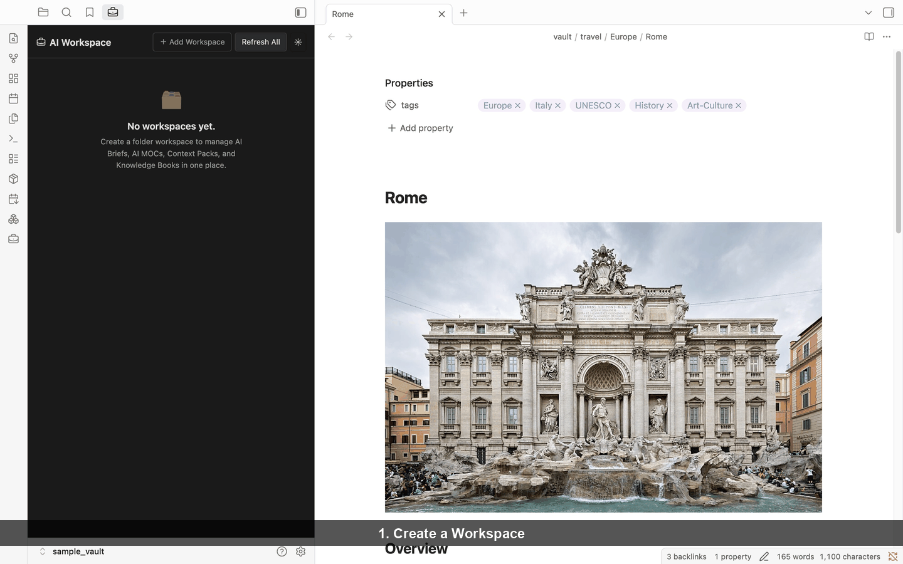
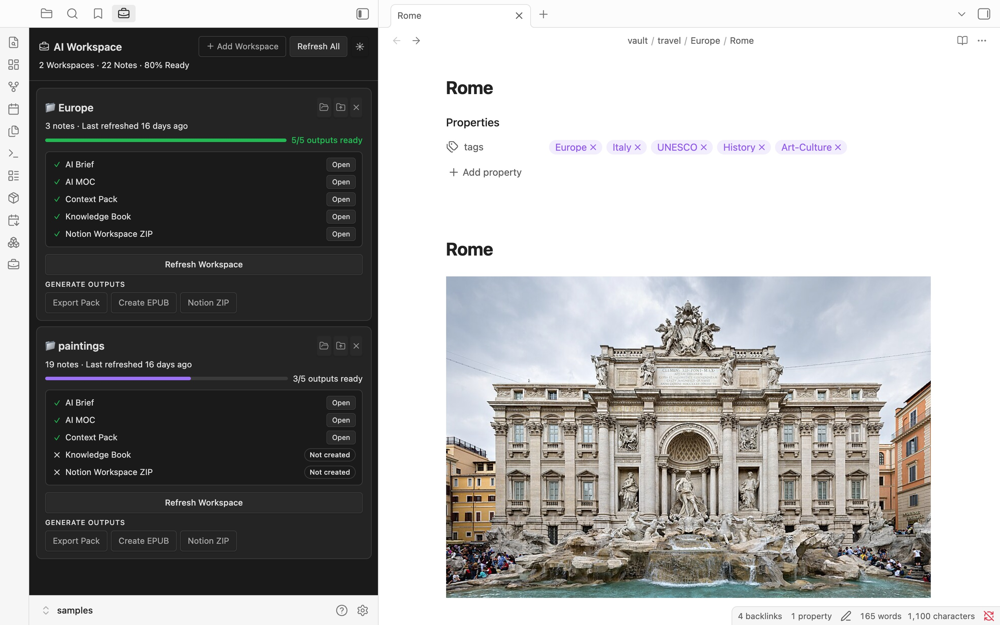
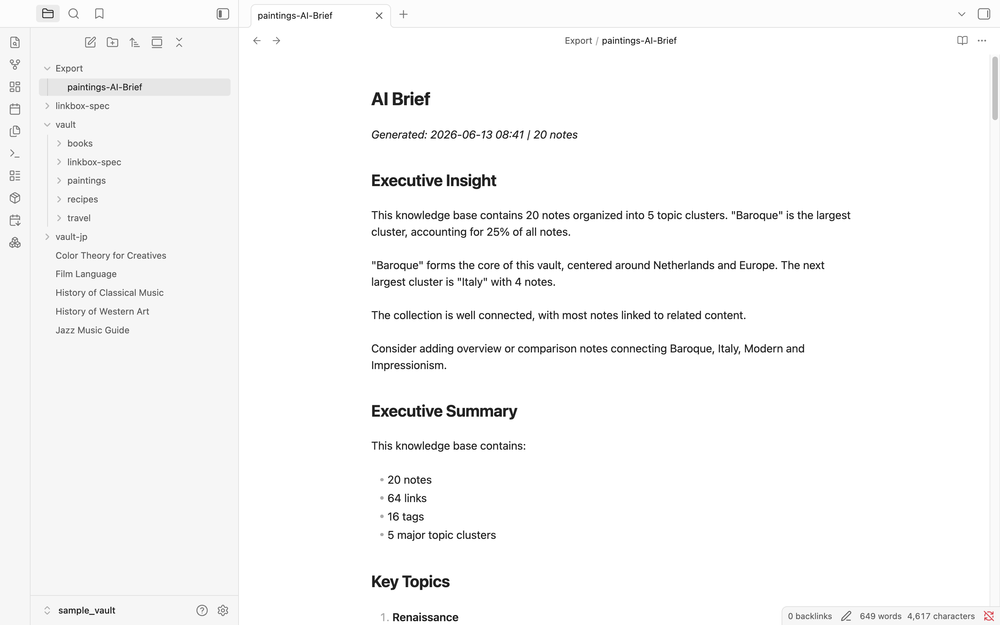
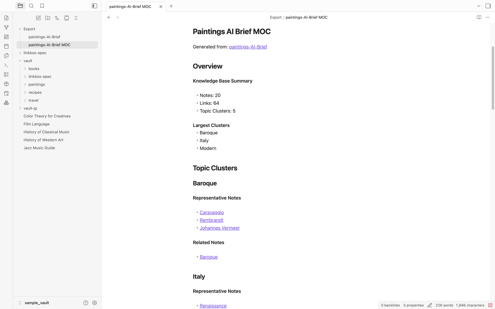
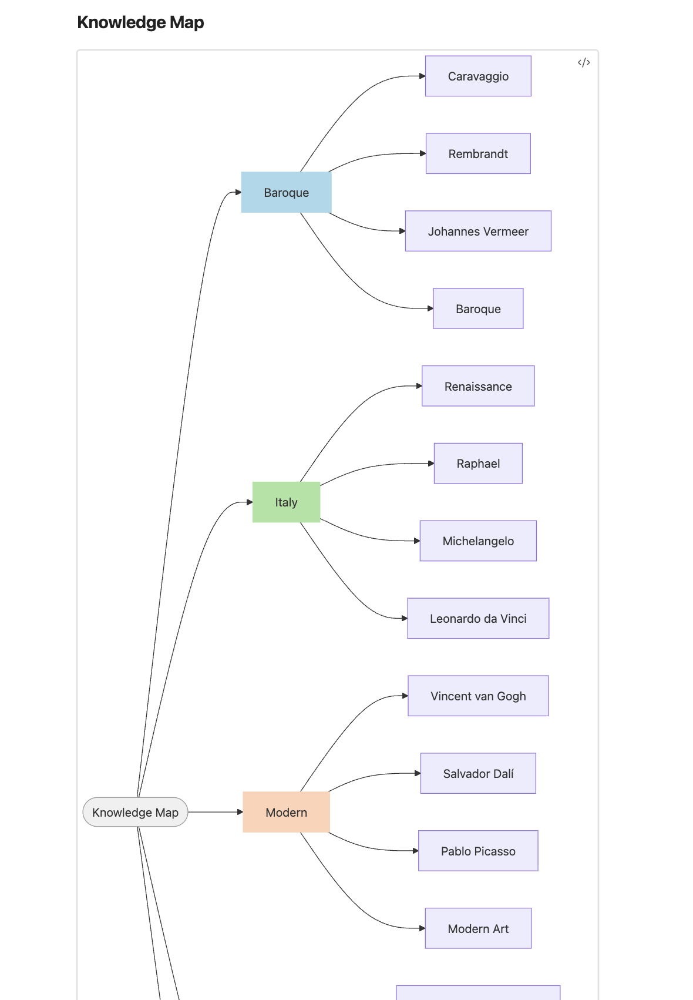
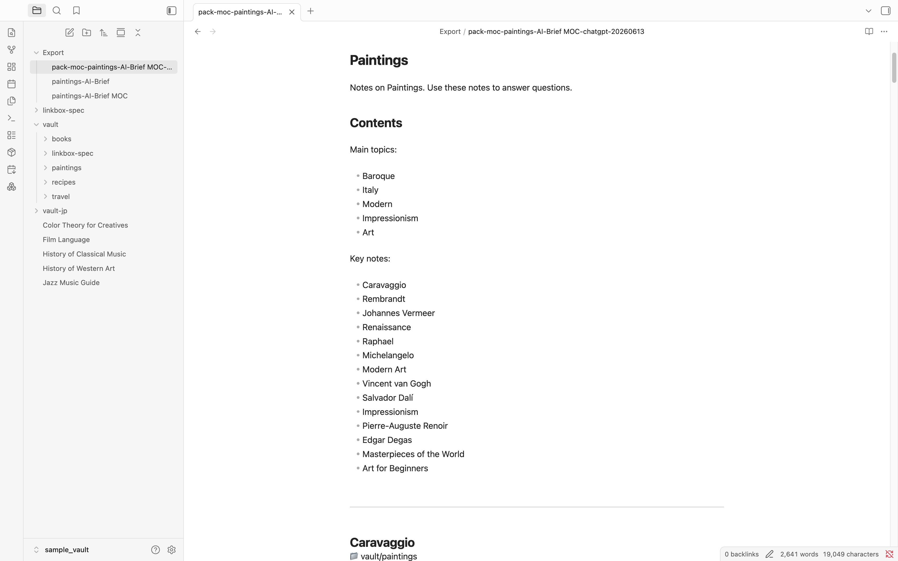

# AI Context Pack

Turn your Obsidian vault into an AI-ready knowledge workspace.

Manage AI Briefs, AI MOCs, Context Packs, and Knowledge Books from one place.

**Manage → Analyze → Organize → Export → Ask → Read**



Turn your Obsidian notes into reusable AI knowledge.

**Analyze → Organize → Export → Ask → Read**

## Quick Workflow

1. Create a Workspace
2. Add a Folder Workspace
3. Analyze Notes (AI Brief + AI MOC)
4. Generate Knowledge Outputs
5. Export for AI Tools
6. Read as a Knowledge Book (EPUB)

---

## What is AI Context Pack?

AI Context Pack transforms your Obsidian notes into reusable AI knowledge.

Create AI Briefs, AI MOCs, Context Packs, and Knowledge Books, then manage everything from a single Workspace View.

Compatible with:

- ChatGPT
- Claude
- Gemini
- NotebookLM

---

## New in v4.0: AI Workspace View

Manage AI-ready outputs for each folder from a single dashboard.

Track completion status, open generated outputs, refresh workspaces, and see what is missing.

- Workspace progress tracking
- AI Brief management
- AI MOC management
- Context Pack management
- Knowledge Book management
- Refresh Workspace
- Refresh All

---

## What Can I Do?

✅ Manage AI Workspaces

✅ Generate AI Briefs

✅ Create AI MOCs

✅ Export Context Packs

✅ Generate Knowledge Books (EPUB)

✅ Track Workspace Completion

✅ Refresh Outputs When Notes Change

---

## Core Workflow

```text
Obsidian Notes
      ↓
AI Workspace
      ↓
AI Brief
      ↓
AI MOC
      ↓
Context Pack
      ↓
Knowledge Book
      ↓
ChatGPT / Claude / Gemini / NotebookLM
```

---

## Core Features

**AI Workspace View** — Track and manage all AI outputs per folder from one panel.

**AI Brief** — Analyze a folder: topic clusters, knowledge map, and suggested prompts.

**AI MOC** — Structured Map of Content from your AI Brief, ready to export.

**Context Pack** — Clean Markdown bundle for ChatGPT, Claude, Gemini, NotebookLM, and Claude Code.

**Knowledge Book (EPUB)** — Structured EPUB with cover and TOC. Read in Kindle, Apple Books, or Kobo.

---

## Quick Start

1. Install AI Context Pack
2. Create a Folder Workspace
3. Generate an AI Brief
4. Generate an AI MOC
5. Export a Context Pack or create a Knowledge Book

---

## Tutorial

Learn the complete workflow from notes to AI-ready outputs.

👉 [Tutorial: Create Your First AI Workspace](docs/tutorials/tutorial-en-workspace.md)

In this tutorial, Alice learns how to:

- Create a Folder Workspace
- Generate an AI Brief
- Generate an AI MOC
- Export a Context Pack
- Create a Knowledge Book
- Keep everything up to date with Workspace View

---

## Screenshots



*AI Workspace View — manage all outputs from one place*

<div align="center">

<p><em>AI Brief — understand your vault before exporting</em></p>
</div>

<div align="center">

<p><em>AI MOC — organize insights into a navigable structure</em></p>
</div>

---

## Example Use Cases

### Research Workspace

Research notes → AI Brief → ChatGPT

Use AI Brief to understand your research, then export a Context Pack to ask deep questions.

### Learning Workspace

Study notes → Knowledge Book → Kindle

Turn your study notes into a structured EPUB you can read anywhere.

### Project Workspace

Project documentation → Context Pack → Claude

Package specs, architecture notes, and documentation for Claude or Claude Code.

### Personal Knowledge Base

Vault → Workspace View → Long-term AI Knowledge

Track the completeness of your entire knowledge base and keep AI outputs up to date as your notes evolve.

---

## Installation

### Community Plugins (Recommended)

1. Open **Settings → Community plugins → Browse**
2. Search for **AI Context Pack**
3. Install and enable

### Manual Installation

Download the [latest release](https://github.com/dualyze-ai/obsidian-context-pack/releases/latest) and copy `main.js`, `manifest.json`, and `styles.css` to:

```text
.obsidian/plugins/context-pack-for-notebooklm/
```

### Sample Vaults

| Vault | Notes | Download |
|---|---|---|
| 🇺🇸 English | 86 notes | [vault-sample-en.zip](https://s3.ap-northeast-1.amazonaws.com/assets.dualyzeai.com/obsidian-context-pack/vault-sample-en.zip) |
| 🇯🇵 Japanese | 86件 | [vault-sample-jp.zip](https://s3.ap-northeast-1.amazonaws.com/assets.dualyzeai.com/obsidian-context-pack/vault-sample-jp.zip) |

---

## Part of the Dualyze Ecosystem

```text
DualyzeAI
      ↓
Obsidian
      ↓
AI Context Pack
      ↓
ChatGPT / Claude / Gemini / NotebookLM
```

| Tool | Role |
|---|---|
| [DualyzeAI](https://dualyzeai.com) | Compare & Analyze |
| Obsidian | Save & Organize |
| AI Context Pack | Package & Prepare |
| Dualyze Notes | Capture & Sync |
| Dualyze Structure | Structure & Visualize |

---

## Details

<details>
<summary>AI Brief — full details</summary>

AI Brief analyzes a folder and generates:

- **Executive Insight** — one-paragraph knowledge summary
- **Topic Clusters** — groups of related notes with representative examples
- **Knowledge Map** — Mermaid diagram showing cluster relationships
- **Relationship Map** — similarity scores between individual notes
- **Knowledge Health** — orphan notes, duplicate candidates, connectivity score
- **Suggested Prompts** — ready-to-use AI prompts for your content

AI Brief is saved as a Markdown file with frontmatter, making it reusable across all workflows.

<div align="center">

</div>

*AI Brief summarizes the structure, coverage, and major themes of a selected folder.*

<div align="center">

</div>

*Knowledge Map generated from a 20-note vault (excerpt).*

</details>

<details>
<summary>AI MOC — full details</summary>

AI MOC (Map of Content) is generated from an AI Brief or any note.

It follows wikilinks outward to build a structured navigation layer:

```text
Root Note
    │
    ├── Core Concepts
    │       └── Related Notes
    │
    └── Referenced By
```

AI MOC can be used directly as Context Pack source material.

<div align="center">

</div>

*AI MOC turns discovered clusters into a structured navigation layer.*

</details>

<details>
<summary>Knowledge Book (EPUB) — full details</summary>

Knowledge Books are generated from an AI Brief and its source notes.

Structure:

- Cover page with title, cover image (if found), note count, and date
- AI Brief as a preface (diagnostic sections removed)
- Hierarchical table of contents from AI Brief clusters
- Source notes as book chapters
- Embedded images from note content

Supported readers: Kindle, Apple Books, Kobo, Calibre, and any EPUB reader.

#### How to create a Knowledge Book

1. Generate an AI Brief from a folder.
2. Right-click the generated AI Brief.
3. Choose **Create Knowledge Book (EPUB)**.
4. Open the `.epub` file in Kindle, Apple Books, or another EPUB reader.


</details>

<details>
<summary>Context Pack format</summary>

Context Packs are single Markdown files that bundle related notes.

Each pack includes:

- A structured header with source, date, and note count
- Clean note content (frontmatter stripped, Obsidian syntax removed)
- AI-specific instructions for the selected output target
- Token count estimate

Source options: folder, tag, MOC, AI MOC, selected notes, daily notes.

<div align="center">

</div>

</details>

<details>
<summary>Supported AI Assistants</summary>

| AI | Chat | Project / Notebook |
|---|---|---|
| ChatGPT | ✓ | ✓ Projects |
| Claude | ✓ | ✓ Project |
| Gemini | ✓ | ✓ Notebook |
| Claude Code | ✓ | — |
| NotebookLM | — | ✓ |

</details>

<details>
<summary>Project Knowledge Packs — freshness tracking</summary>

Track which notes were sent to ChatGPT Projects, Claude Projects, Gemini, or NotebookLM.

Know when:

- Notes were updated since the last export
- New matching notes were added
- Files were deleted or renamed

Re-export only when needed.

</details>

<details>
<summary>Daily Notes Pack</summary>

Create AI-ready packs from daily notes.

- Date range selection
- Weekly summaries
- Tag exclusion
- Auto-detection of Daily Notes folders

</details>

<details>
<summary>Settings</summary>

Key settings:

- **Output folder** — where AI Briefs, MOCs, and Context Packs are saved
- **EPUB sort strategy** — how notes are ordered in Knowledge Books
- **Enable Mermaid** — include Knowledge Map diagrams in AI Brief
- **AI Brief language** — English or Japanese output

</details>

---

## Contributing

Issues and pull requests welcome on [GitHub](https://github.com/dualyze-ai/obsidian-context-pack).

## License

MIT
