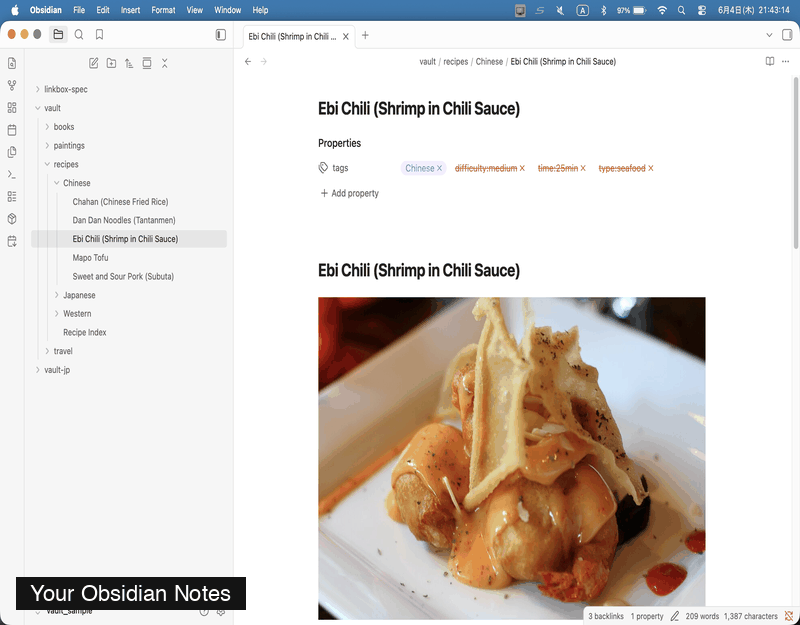
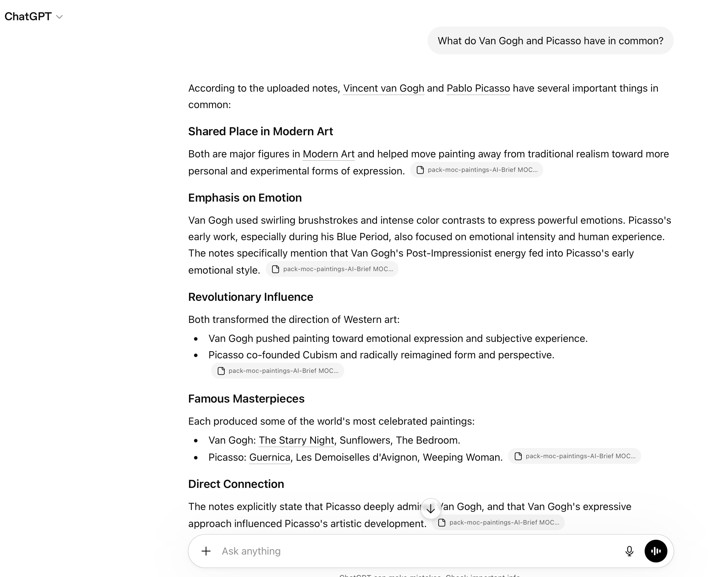
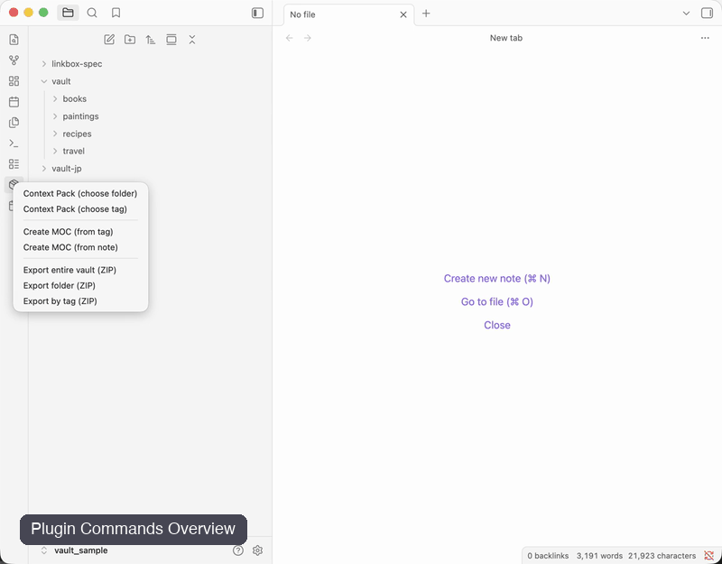

# AI Context Pack

> Analyze your vault. Organize your knowledge. Export AI-ready context.

## Analyze → Organize → Export

```text
Folder
↓
Generate AI Brief
↓
Generate AI MOC from AI Brief
↓
Create Context Pack
↓
Use with ChatGPT / Claude / Gemini / NotebookLM / Claude Code
```

AI Context Pack helps transform scattered notes into reusable AI knowledge.

### Analyze
Generate AI Briefs to discover:
- Topic Clusters
- Knowledge Maps
- Relationship Maps
- Knowledge Health

### Organize
Generate AI MOCs from AI Briefs and turn insights into navigable knowledge structures.

### Export
Create clean Context Packs optimized for AI assistants.

---

<div align="center">

</div>

## From notes to knowledge

1. Collect notes
2. Build knowledge maps (AI MOC)
3. Package context
4. Use with ChatGPT Projects, Claude Projects, Gemini, and NotebookLM
5. Keep your knowledge fresh

## ✨ New in v3.2: Analyze → Organize → Export → Ask

AI Context Pack now helps you move from scattered notes to reusable AI knowledge in a clearer workflow:

```text
Folder
↓
Generate AI Brief
↓
Visualize Knowledge Map
↓
Generate AI MOC from AI Brief
↓
Create Context Pack
↓
Ask questions in ChatGPT / Claude / Gemini / NotebookLM / Claude Code
```

### 1. Analyze your vault with AI Brief

Generate an AI Brief to understand your notes before exporting them.

AI Brief identifies:

- Executive insights
- Topic clusters
- Knowledge maps
- Relationship maps
- Knowledge health
- Suggested AI prompts

<div align="center">

</div>

*AI Brief summarizes the structure, coverage, and major themes of a selected folder.*

---

### 2. Visualize knowledge structure

AI Brief generates a visual Knowledge Map that shows topic clusters and representative notes.

<div align="center">

</div>

*Knowledge Map generated from a 20-note Art History vault (excerpt).*

---

### 3. Organize insights into an AI MOC

Generate an AI MOC from the AI Brief to transform analysis into a navigable knowledge structure.

<div align="center">

</div>

*AI MOC turns discovered clusters into a structured navigation layer.*

---

### 4. Export an AI-ready Context Pack

Create a clean Context Pack from the AI MOC.

<div align="center">

</div>

*Context Packs are optimized for ChatGPT, Claude, Gemini, NotebookLM, and Claude Code.*

---

### 5. Ask questions with your AI assistant

Upload the exported Context Pack and ask natural-language questions.

<div align="center">

</div>

*ChatGPT answering a question using only the exported Context Pack.*

---

## Supported AI Assistants

| AI | Chat | Project / Notebook |
|---|---|---|
| ChatGPT | ✓ | ✓ Projects |
| Claude | ✓ | ✓ Project |
| Gemini | ✓ | ✓ Notebook |
| Claude Code | ✓ | — |
| NotebookLM | — | ✓ |

---

## Why AI Context Pack?

Raw Obsidian notes contain a lot of information that is useful to humans but noisy for AI:

- Wikilinks
- Frontmatter
- Comments
- Templates
- Embedded content
- Obsidian-specific syntax

AI Context Pack transforms your vault into clean, structured context optimized for AI assistants.

---

## How it works

```text
Obsidian Vault
        ↓
   Generate AI Brief
        ↓
   Visualize Knowledge Map
        ↓
   Generate AI MOC
        ↓
   Create Context Pack
        ↓
ChatGPT / Claude
Gemini / NotebookLM
Claude Code
```

## Project Knowledge Packs

AI Context Pack doesn't stop at export.

Track which notes were sent to:

- ChatGPT Projects
- Claude Projects
- Gemini
- NotebookLM

and monitor whether they are still up to date.

### Freshness Tracking

Know when:

- Notes were updated
- New matching notes were added
- Files were deleted or renamed

Re-export only when needed.

### Context Diff

See exactly what changed since the last export.

No more guessing whether your AI project knowledge is stale.

→ [Learn more about Project Knowledge Packs](https://github.com/dualyze-ai/obsidian-context-pack/blob/main/docs/project-knowledge-packs.md)

---

### Context Pack

Bundle related notes into a single AI-ready Markdown file.

Organize by:

- Folder
- Tag
- MOC
- AI MOC

All Obsidian-specific syntax is cleaned automatically.

### AI MOC

Generate a Map of Content from any note.

AI MOC follows wikilinks outward and creates a structured knowledge map:

```text
Root Note
    │
    ├── Core Concepts
    │       └── Related Notes
    │
    └── Referenced By
```

No manual index maintenance required.

### Output Targets

Choose where the pack will be used:

- ChatGPT Chat
- ChatGPT Projects
- Claude Chat
- Claude Project
- Gemini Chat
- Gemini Notebook
- Claude Code
- NotebookLM

AI-specific instructions are added automatically.

### Purpose-Aware Modes

Choose how the AI should use your notes:

| Mode | Best for |
|---|---|
| Research | Analysis and evidence gathering |
| Learning | Tutorials and study |
| Writing | Documentation and articles |
| Development | Specs, code, architecture |

### Daily Notes Pack

Create AI-ready packs from daily notes.

Features:

- Date range selection
- Weekly summaries
- Tag exclusion
- Auto-detection of Daily Notes folders

---

<div align="center">

</div>

---

## Installation

### Community Plugins (Recommended)

1. Open **Settings → Community plugins → Browse**
2. Search for **AI Context Pack**
3. Install
4. Enable

### Manual Installation

Download the [latest release](https://github.com/dualyze-ai/obsidian-context-pack/releases/latest) and copy:

- `main.js`
- `manifest.json`
- `styles.css`

to:

```text
.obsidian/plugins/context-pack-for-notebooklm/
```

---

## Sample Vaults

Try the plugin immediately without preparing your own vault.

| Vault | Notes | Topics | Download |
|---|---|---|---|
| 🇺🇸 English | 86 notes | recipes / travel / books / paintings / linkbox-spec | [vault-sample-en.zip](https://s3.ap-northeast-1.amazonaws.com/assets.dualyzeai.com/obsidian-context-pack/vault-sample-en.zip) |
| 🇯🇵 Japanese | 86件 | 料理 / 旅行 / 読書 / 絵画 / linkbox-spec | [vault-sample-jp.zip](https://s3.ap-northeast-1.amazonaws.com/assets.dualyzeai.com/obsidian-context-pack/vault-sample-jp.zip) |

### Quick Start

1. Download a sample vault
2. Unzip
3. Open the folder as a vault in Obsidian
4. Enable AI Context Pack
5. Explore:

- Context Pack
- AI MOC
- Daily Notes Pack
- Claude Code workflows

Example:

```text
Masterpieces of the World.md
        ↓
Create AI MOC from this note
        ↓
Related Notes
        ↓
Generate Context Pack
        ↓
Ask ChatGPT or Claude
```

---

## Documentation

### [Project Knowledge Packs](https://github.com/dualyze-ai/obsidian-context-pack/blob/main/docs/project-knowledge-packs.md)

Freshness tracking, context diff, and re-export workflows.

### [Features](https://github.com/dualyze-ai/obsidian-context-pack/blob/main/docs/features.md)

Complete feature reference:

- Project Knowledge Packs
- Context Pack
- Output Targets
- AI MOC
- Mode Selector
- Daily Notes Pack
- Settings

### [AI Guides](https://github.com/dualyze-ai/obsidian-context-pack/blob/main/docs/ai-guides.md)

Step-by-step guides for:

- ChatGPT
- ChatGPT Projects
- Claude
- Claude Projects
- Gemini
- Gemini Notebook
- Claude Code
- NotebookLM

### [AI Brief Workflow](https://github.com/dualyze-ai/obsidian-context-pack/blob/main/docs/ai-brief-workflow.md)

Analyze → Organize → Export → Ask workflow:

- Generate AI Brief
- Visualize Knowledge Map
- Generate AI MOC from AI Brief
- Create Context Pack
- Ask questions with AI

### [AI Brief Generator](https://github.com/dualyze-ai/obsidian-context-pack/blob/main/docs/ai-brief-generator.md)

Understand your vault before exporting it.

- Topic Clustering
- Knowledge Maps
- Relationship Analysis
- Knowledge Health
- Suggested AI Prompts

### [Changelog](https://github.com/dualyze-ai/obsidian-context-pack/blob/main/docs/changelog.md)

Release history and feature updates.

---

## Part of the AI Research Workflow

AI Context Pack can be used on its own,
or as part of a broader AI research workflow:

| Tool | Role |
|--------|--------|
| DualyzeAI | Compare & Analyze |
| Obsidian | Save & Organize |
| AI Context Pack | Package & Prepare |
| ChatGPT / Claude / Gemini / NotebookLM | Research Deeper |

Optional:
→ [Learn more about DualyzeAI](https://dualyzeai.com)

---

## Roadmap

Current focus:

- Better Project Knowledge workflows
- Additional AI targets
- Enhanced AI MOC generation
- Improved token management
- Larger vault support

---


## Contributing

Issues and pull requests are welcome on [GitHub](https://github.com/dualyze-ai/obsidian-context-pack).

---

## License

MIT

Made by [dualyzeAI](https://dualyzeai.com)
