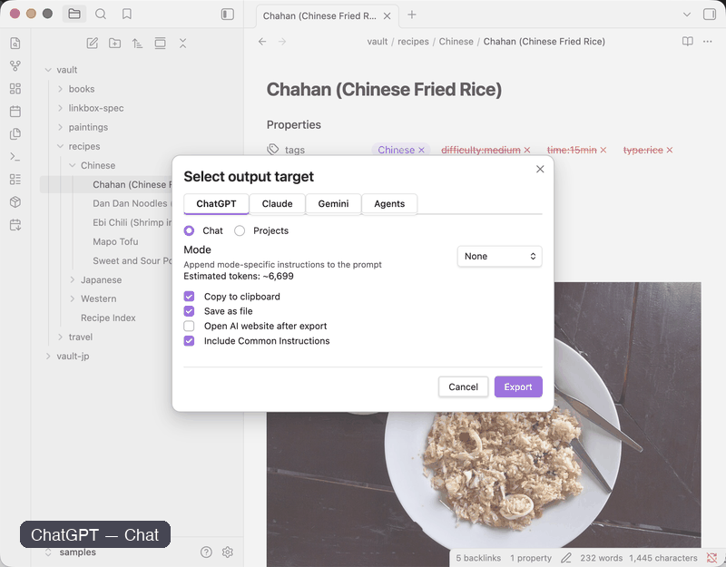

# AI Context Pack — Features

This page explains every feature available in AI Context Pack.

---

# Usage

AI Context Pack adds three ribbon icons to the Obsidian sidebar.

| Icon | Function |
|------|----------|
|  | [Project Knowledge Packs](project-knowledge-packs.md) — freshness tracking panel |
|  | Context Pack / Export menu |
|  | Daily Notes Pack |

All commands are also available from:

- Command Palette (`Cmd/Ctrl+P`)
- Right-click context menus
- File Explorer menus

---

# Project Knowledge Packs

Track which notes were sent to ChatGPT Projects, Claude Projects, Gemini, or NotebookLM — and monitor whether they are still up to date.

| Status | Meaning |
|---|---|
| 🟢 Fresh | No changes detected |
| 🟡 Needs Review | A small number of notes changed |
| 🔴 Stale | Significant changes detected |

→ [Full documentation](project-knowledge-packs.md)

---

# Context Pack

Context Pack bundles multiple notes into a single AI-ready Markdown file.

Supported sources:

| Source | Description |
|---|---|
| Folder | All notes inside a folder |
| Tag | All notes with a selected tag |
| MOC | Notes linked from a MOC |
| AI MOC | Notes discovered automatically from a root note |

After generation, the Output Target Selector appears.

---

## Available Commands

| Trigger | Source |
|---|---|
| Ribbon → Context Pack (choose folder) | Folder |
| Ribbon → Context Pack (choose tag) | Tag |
| Right-click file → Create Context Pack from this MOC | MOC |
| Command: Create Context Pack from MOC | MOC |

Output filename example:

```text
pack-paintings-chatgpt-20260605.md
```

---

# Output Target Selector

Choose where the generated context will be used.

| Tab | Options |
|---|---|
| ChatGPT | Chat / Projects |
| Claude | Chat / Project |
| Gemini | Chat / Notebook |
| Agents | Claude Code / NotebookLM |

---

## Chat

Designed for immediate conversations.

Behavior:

- Copies pack to clipboard
- Adds AI-specific instructions
- Ready to paste directly

Examples:

- ChatGPT Chat
- Claude Chat
- Gemini Chat
- Claude Code

---

## Projects / Project / Notebook

Designed for persistent knowledge.

Behavior:

- Saves a file
- Adds Project Knowledge instructions
- Upload once, reuse repeatedly

Examples:

- ChatGPT Projects
- Claude Project
- Gemini Notebook
- NotebookLM

---

# Export (ZIP)

Export notes as individual cleaned Markdown files.

Supported exports:

| Trigger | Source |
|---|---|
| Export entire vault (ZIP) | Entire vault |
| Export folder (ZIP) | Folder |
| Export by tag (ZIP) | Tag |
| Export this folder (ZIP) | Folder |
| Export this note (.md) | Single note |

---

# MOC (Map of Content)

A MOC (Map of Content) is an Obsidian note that acts as a table of contents.

AI Context Pack can generate MOCs automatically.

| Trigger | Source |
|---|---|
| Create MOC (from tag) | Tag |
| Create MOC from this folder | Folder |

Generated MOCs can be used as Context Pack sources.

---

# AI MOC

<div align="center">

</div>

AI MOC automatically builds a knowledge map by following wikilinks.

---

## How AI MOC Works

```text
Root Note
    │
    ├── Core Concepts
    │       └── Related Notes
    │
    └── Referenced By
```

The plugin performs a breadth-first traversal of linked notes.

---

## Usage

| Trigger | Action |
|---|---|
| Right-click note → Create AI MOC from this note | Opens dialog |
| Ribbon → Create MOC (from note) | Opens dialog |
| Command Palette → Create AI MOC from note | Opens dialog |

---

## Dialog Options

| Option | Default | Description |
|---|---|---|
| Root Note | — | Starting note |
| Direct Links | | Depth 1 |
| Related Notes | ✓ | Depth 2 |
| Backlinks in MOC | ✓ | Include backlinks |
| Backlinks in Context Pack | | Include backlinks in pack |
| Generate Context Pack | ✓ | Generate pack immediately |

---

## Example

Root note:

```text
Masterpieces of the World
```

Generated structure:

```markdown
# [[Masterpieces of the World]]

## Core Concepts

- [[Impressionism]]
- [[Renaissance]]
- [[Baroque]]
- [[Modern Art]]

## Related Notes

- [[Claude Monet]]
- [[Leonardo da Vinci]]
- [[Rembrandt]]
- [[Vincent van Gogh]]
- [[Pablo Picasso]]

## Referenced By

- [[Museum Guide]]
- [[Art for Beginners]]
```

---

# Purpose-Aware Modes

Modes modify the instructions added to the Context Pack.

Choose how the AI should use your notes.

---

## Available Modes

| Mode | Best for |
|---|---|
| None | General use |
| Research | Analysis and evidence gathering |
| Learning | Teaching and study |
| Writing | Documentation and articles |
| Development | Specs, code, architecture |

---

## Research

Adds instructions such as:

- Separate facts from inference
- Cite source notes
- Compare viewpoints
- Highlight evidence

Best for:

- Reading notes
- Research collections
- Literature reviews

---

## Learning

Adds instructions such as:

- Explain step-by-step
- Define technical terms
- Provide examples
- Build understanding progressively

Best for:

- Study notes
- Certification prep
- Tutorials

---

## Writing

Adds instructions such as:

- Improve structure
- Maintain consistent style
- Consider reader perspective
- Suggest revisions

Best for:

- Blog drafts
- Documentation
- Books and articles

---

## Development

Adds instructions such as:

- Prefer actionable recommendations
- Respect existing architecture
- Explain design tradeoffs
- Avoid speculative changes

Best for:

- Specifications
- Architecture notes
- Engineering documentation

---

## Typical Combinations

| Target | Mode | Use Case |
|---|---|---|
| ChatGPT | Learning | Personal tutor |
| Claude | Research | Deep analysis |
| Gemini | Research | Large knowledge collections |
| Claude Code | Development | Software implementation |

---

# Daily Notes Pack

Create AI-ready packs from Daily Notes.

Click:

```text
calendar-arrow-down
```

or run the corresponding command.

---

## Presets

- This Week
- Last Week
- Last 7 Days
- Last 14 Days
- Last 30 Days
- Custom Range

---

## Auto Detection

Daily Notes Pack automatically detects folders using:

1. Obsidian Daily Notes
2. Japanese Calendar
3. Periodic Notes
4. Vault scan

---

## Additional Features

### Exclude Tags

Example:

```text
#private, #draft
```

Matching notes are skipped.

---

### Weekly Summary

Adds:

```markdown
# Weekly Summary: 2026 Week 22
```

before note content.

---

## Commands

| Command | Description |
|---|---|
| Create pack (default range) | Uses configured range |
| Create pack (choose range) | Opens picker |
| Create weekly summary pack | Includes summary heading |

---

# Settings

## General

| Setting | Description | Default |
|---|---|---|
| Output Folder | Export destination | Vault root |
| Flatten Folder Structure | Single ZIP folder | Off |
| Include Frontmatter Title | Convert title/tags | On |
| Open Folder After Export | Desktop only | Off |
| Custom Replacement Rules | Find/replace processing | — |

---

## Output Settings

| Setting | Description | Default |
|---|---|---|
| Show Output Selector | Show destination dialog | On |
| Default Output Target | Used when selector disabled | NotebookLM |
| Show Token Count | Estimate token usage | On |
| Warn When Over Limit | Token warning | On |
| Open AI Website After Export | Open ChatGPT / Claude / Gemini | Off |
| Include Common Instructions | Add base instructions | On |
| Common Instructions | Shared prompt template | — |

---

## Daily Notes Settings

| Setting | Description | Default |
|---|---|---|
| Auto Detect Daily Notes | Automatic detection | On |
| Daily Notes Folder | Manual override | — |
| Date Format | moment.js format | YYYY-MM-DD |
| Default Range | Quick pack range | Last 7 Days |
| Exclude Tags | Skip matching notes | — |
| Sort Order | Oldest/Newest | Oldest First |

---

# Related Documentation

- README.md
- docs/ai-guides.md
- docs/changelog.md
