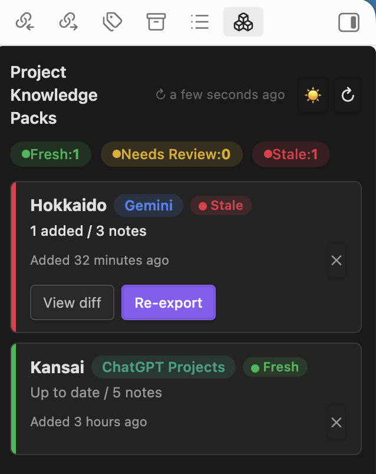

# Project Knowledge Packs

Keep your AI knowledge up to date.

---

<div align="center">

</div>

---

## Opening the panel

Click the **boxes** ribbon icon in the Obsidian sidebar.

```
⊹  Project Knowledge Packs
```

Or run the command:

```
Open Project Knowledge Packs
```

The panel opens in the right sidebar.

---

## Panel overview

```
Project Knowledge Packs          ↻ 2 min ago  🌙  ↻

● Fresh: 5   ● Needs Review: 2   ● Stale: 0

┌─────────────────────────────────────────────┐
│ Hokkaido   ChatGPT Projects   ● Fresh       │
│ Up to date / 3 notes                        │
│ Added 2 days ago                        ✕   │
└─────────────────────────────────────────────┘
┌─────────────────────────────────────────────┐
│ Hakodate   Claude Project   ● Needs Review  │
│ 1 updated / 5 notes                         │
│ Added 3 days ago          View diff  Re-export  ✕ │
└─────────────────────────────────────────────┘
```

**Header**

| Element | Description |
|---|---|
| `↻ 2 min ago` | Time since the last freshness check |
| 🌙 | Toggle dark / light mode |
| ↻ | Re-run the freshness check |

**Summary chips**

Shows the count of packs at each freshness level.

**Pack cards**

Sorted by freshness — the most outdated packs appear at the top.

---

## The problem

ChatGPT Projects, Claude Projects, and NotebookLM are great for long-term knowledge.

But knowledge becomes stale.

You update your notes.  
Your AI project doesn't.

Most tools stop at export.

**AI Context Pack keeps tracking your knowledge after export.**

---

## What gets tracked

- Updated notes
- Newly matching notes
- Deleted notes
- Renamed notes

---

## Freshness Status

| Status | Meaning |
|---|---|
| 🟢 Fresh | No changes detected |
| 🟡 Needs Review | A small number of notes changed |
| 🔴 Stale | Significant changes detected |

Packs are sorted by freshness — the most outdated rise to the top.

---

## Context Diff

See exactly what changed since the last export.

- Added notes
- Updated notes
- Removed notes

Re-export with confidence.

---

## Rename tracking

When you rename or move a note or folder in your vault, AI Context Pack automatically updates the pack registry.

No broken references. No stale paths.

---

## Re-export

One click to re-export a pack with the same settings used originally.

The output target modal opens pre-filled with your previous selection.

---

## How it works

When you export a pack, AI Context Pack records:

- The source (folder, tag, MOC, or daily notes)
- The output target (ChatGPT Projects, Claude Projects, Gemini, NotebookLM)
- A snapshot of every file: path, size, and last modified time

On each check, the current state of the vault is compared against the snapshot.

Changes in size or modification time are flagged immediately.

---

## Supported targets

| Target | Tracked |
|---|---|
| ChatGPT Projects | ✓ |
| Claude Projects | ✓ |
| Gemini | ✓ |
| NotebookLM | ✓ |

---

→ [Back to README](../README.md)
